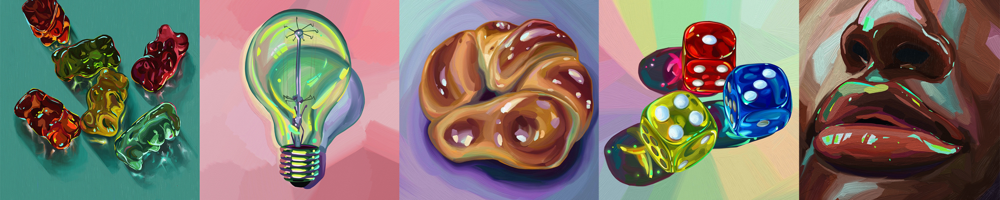
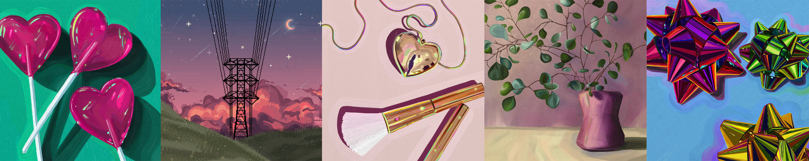

<!--
**MeltedGreenVelvet/MeltedGreenVelvet** is a ✨ _special_ ✨ repository because its `README.md` (this file) appears on your GitHub profile.

Here are some ideas to get you started:

- 🔭 I’m currently working on ...
- 🌱 I’m currently learning ...
- 👯 I’m looking to collaborate on ...
- 🤔 I’m looking for help with ...
- 💬 Ask me about ...
- 📫 How to reach me: ...
- 😄 Pronouns: ...
- ⚡ Fun fact: ...
-⚡ Fun fact: I play way too much Stardew Valley  
-->

HI, I'M MORGAN! 👽 (SHE/HER) 
=======================

I am a creative. ✒️ I like to make things.

I got my bachelor's degree in Computer Science, had an identity crisis because IT helpdesks, database administration, and backend software engineering will never be my shtick, and found myself in a "Baby's First Graphic Design and Digital Marketing" position. Which is great. I learned Adobe CC, photography, and design! I learned how to paint (this is a biggie for me)! I learned what a good website can truly do for a business. 

But, it's been years. I don't remember a whole lot about how to code. So, I'm rectifying that now, and I'm focusing on frontend--> A path I didn't get much experience with back in college, but a path I've learned that I very much enjoy.

🌱 I’m currently learning: React, Figma, Sass, GSAP  

WANNA CONNECT?
---------------

📫 How to reach me: morganeltrask@gmail.com  

